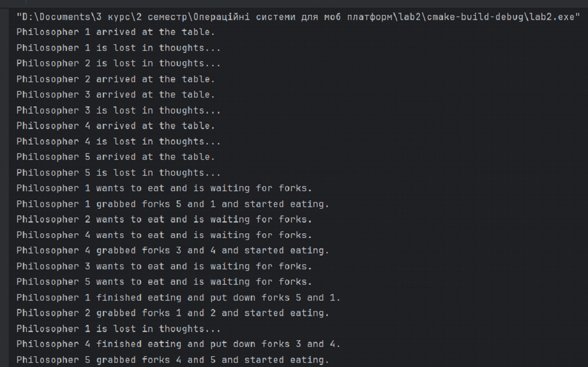

# 🍽️ Dining Philosophers Problem

> A robust solution to the classic concurrency and synchronization problem, written in C. Developed as Lab 2 for the "Operating Systems" course at Taras Shevchenko National University of Kyiv.

---

## 🛠️ Tech Stack & Tools
- **Language:** C
- **Concurrency Libraries:** POSIX Threads (`<pthread.h>`), Semaphores (`<semaphore.h>`)
- **System Calls:** `usleep()`, `rand()`

---

## ⚙️ How It Works
The project implements a deadlock-free and livelock-free algorithm to simulate five philosophers sharing a table and forks.

### Algorithm Highlights
- **State Machine Architecture:** Each philosopher strictly alternates between three states: `THINKING`, `WAITING`, and `EATING`.
- **Resource Locking Mechanism:** 
  - A global counting semaphore (`table_lock`) restricts concurrent access to the table, ensuring that state checks and fork acquisition are atomic.
  - Individual semaphores (`fork`) for each philosopher block them from eating until both neighboring forks are available.
- **Deadlock Prevention:** The logic prevents cyclical waiting by checking the status of adjacent neighbors before picking up forks. An asymmetric waiting approach mitigates livelocks.
- **Scalability:** The algorithm relies solely on relative indexing (`LEFT_FORK`, `RIGHT_FORK`), making it scalable to `N` philosophers without hardcoded priorities or a central "waiter" entity.

---

## 📸 Output Demonstration
Below is a snapshot of the terminal output, demonstrating the asynchronous execution of threads. You can observe philosophers arriving, thinking, acquiring forks, eating, and releasing them back to the table without entering a deadlock.

